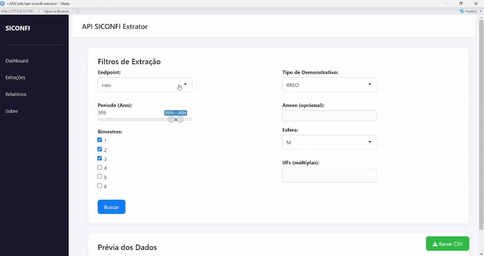
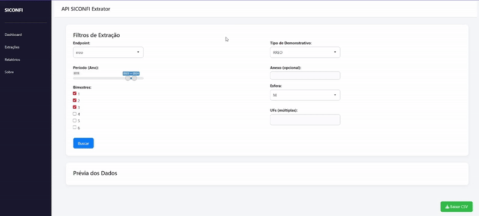

<h1 align="center">API SICONFI Extrator</h1>

<p align="center">
  <em>Interface amigável pra qualquer pessoa conseguir extrair dados da API do SICONFI em poucos cliques</em>
</p>

<p align="center">
  <a href="">
    
  </a>
  <a href="#">
    
  </a>
  <a href="#">
    
  </a>

</p>

---

## Visão Geral

**API SICONFI Extrator** é um app em **R/Shiny** para coletar dados públicos do Tesouro Nacional via **API do SICONFI**.  
Escolha o **endpoint**, **UF(s)** e **período**, clique em **Buscar** para ver a **prévia** e, se quiser, **baixe o CSV**.

Destaques:
- Itera automaticamente por **múltiplas UFs** e **intervalos de anos**  
- **Barra de progresso** e **notificações** durante a importação  
- Tratamento de **erros/vazios** sem travar a aplicação  
- Respeito ao **rate limit** (pausas entre requisições de 1s)

---

## Demo

<p align="center">
  
</p>
<p align="center"><i>Extrato de Entregas (2022-2024, AC) </i></p>

---

<p align="center">
  
</p>
<p align="center"><i>Dados do RREO (2023-2024, 1 bim, AL e AM)</i></p>

---

<p align="center">
  
</p>
<p align="center"><i>Exportando os dados pelo botão “Baixar CSV”</i></p>

---

## Motivação

A documentação da API do Siconfi abre desaconselhando que pessoas sem experiência utilizem a API e recorram aos dados disponibilizados no Portal da Transparência. Com esta aplicação, qualquer pessoa consegue consumi-la de forma personalizada, pela motivação que tenha, sem ter que saber como trabalhar com APIs.

---

## Funcionalidades

- **Seleção interativa** de endpoint, período e UFs (múltiplas)
- **Prévia** dos dados diretamente na interface (até 20 linhas)
- **Exportação para CSV** via `downloadHandler`
- **Feedback visual**: `withProgress()` e `showNotification()`
- **Normalização** de parâmetros (ex.: UFs por código IBGE)
- **Estrutura modular** (`R/extrator.R`) para manter e ampliar endpoints

---

## Endpoints Suportados

| Endpoint             | Parâmetros principais                                                                 |
|---------------------|----------------------------------------------------------------------------------------|
| `entes`             | —                                                                                      |
| `extrato_entregas`  | `id_ente`, `an_referencia`                                                             |
| `dca`               | `an_exercicio`, `no_anexo` (opcional), `id_ente`                                       |
| `rgf`               | `an_exercicio`, `in_periodicidade`, `nr_periodo`, `co_tipo_demonstrativo`, `no_anexo` (opt), `co_esfera`, `co_poder`, `id_ente` |
| `rreo`              | `an_exercicio`, `nr_periodo`, `co_tipo_demonstrativo`, `no_anexo` (opt), `co_esfera`, `id_ente` |
| `msc_controle`      | `id_ente`, `an_referencia`, `me_referencia`, `co_tipo_matriz`, `classe_conta`, `id_tv` |
| `msc_orcamentaria`  | `id_ente`, `an_referencia`, `me_referencia`, `co_tipo_matriz`, `classe_conta`, `id_tv` |
| `msc_patrimonial`   | `id_ente`, `an_referencia`, `me_referencia`, `co_tipo_matriz`, `classe_conta`, `id_tv` |
| `anexos-relatorios` | —                                                                                      |

> Dependendo do período/UF, a API pode retornar vazio. Comece com filtros mais amplos e refine.

---

## Tecnologias

- **R 4.5+** + **Shiny**
- **httr**, **jsonlite**, **dplyr**
- **(Opcional)** `DT` (tabelas interativas), `shinyFiles` (salvar direto em um caminho local)
- **Docker** (containerização)

---

## Como rodar (passo a passo)

**Você precisa de:**  
- **R** (gratuito): https://cran.r-project.org/  
- **RStudio** (recomendado): https://posit.co/download/rstudio-desktop/

1. **Baixe o projeto**  
   No GitHub, clique em **Code -> Download ZIP**. Extraia o ZIP em uma pasta.

2. **Abra o projeto no RStudio**  
   No RStudio, vá em **File -> Open File…** e abra o arquivo **`app.R`** (que está na pasta do projeto).

3. **Instale os pacotes necessários** (copie e cole no Console do R e pressione Enter):
   ```r
   install.packages(c("shiny", "httr", "jsonlite", "dplyr"))

4. **Execute o aplicativo**  
   Clique em **Run App** (canto superior direito do editor no RStudio).  
   O endereço (ex.: `http://127.0.0.1:5130`) aparecerá. Abra no navegador se não abrir automaticamente.
