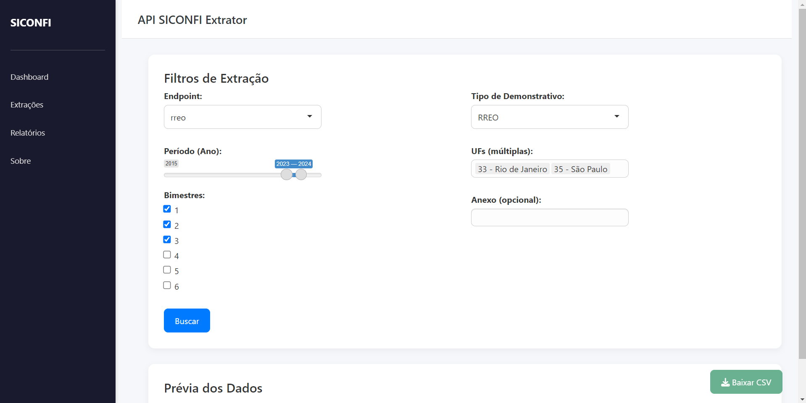

# api-siconfi-extrator

**Software em R com Shiny para extrair facilmente dados da API do Siconfi**  
Permite selecionar o endpoint, ano e UF por meio de menus intuitivos e obter os dados com poucos cliques.

## Funcionalidades

- Escolha interativa de endpoint, ano e UF
- Visualização de dados diretamente na interface
- Exportação para CSV

## Versão Inicial do Dashboard

<p align="center">
  
  <br>
  <em>Figura 1 - Protótipo do dashboard de extração.</em>
</p>

## Tecnologias Utilizadas

- [R](https://www.r-project.org/)
- [Shiny](https://shiny.posit.co/)
- [HTTR](https://cran.r-project.org/web/packages/httr/)
- [JSONLite](https://cran.r-project.org/web/packages/jsonlite/)
- [Docker (opcional)](https://www.docker.com/)

## Como rodar

Com RStudio, abrir o `app.R` e clicar em "Run App".

Com Docker:

```bash
docker build -t siconfi-extrator .
docker run -p 3838:3838 siconfi-extrator
